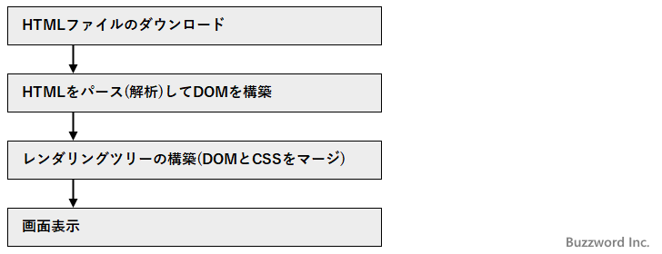
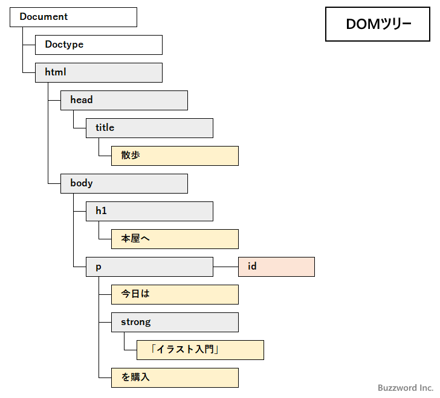

## HTMLファイルのダウンロードから画面表示までの流れ
  

最初に Web サーバから HTML ファイルのダウンロードが行われます。
ダウンロードが完了したら、 HTML ページに記述されている内容をパース(解析)して DOM ツリーと呼ばれるものを構築します。
DOM ツリーとは HTML ページの中のタグやテキストなどを階層構造で表したものです。( JavaScript では DOM の各ノードに対して色々な操作を行うことができます)。
  

DOM の構築とは別にスタイルシートのデータから CSSOM が構築されます。
DOM と CSSOM をマージしてレンダリングツリーが構築されます。最後に何を画面のどこに表示するのかなどの計算が行われてブラウザの画面に表示が行われます。

HTML ページの中に `<script>` タグがあると、パースをいったん停止して `<script>` タグの中の JavaScript のコードが実行されます。

https://www.javadrive.jp/javascript/before/index7.html